# Multithreading

> 课程链接：https://www.bilibili.com/video/BV1V4411p7EF?p=1&vd_source=b67ce643ed65f6136a48fb03481df142


多线程demo

## 01线程简介

任务，进程，线程，多线程


**多任务**：


**多线程：**


**普通方法调用和多线程：**


**程序、进程、线程**

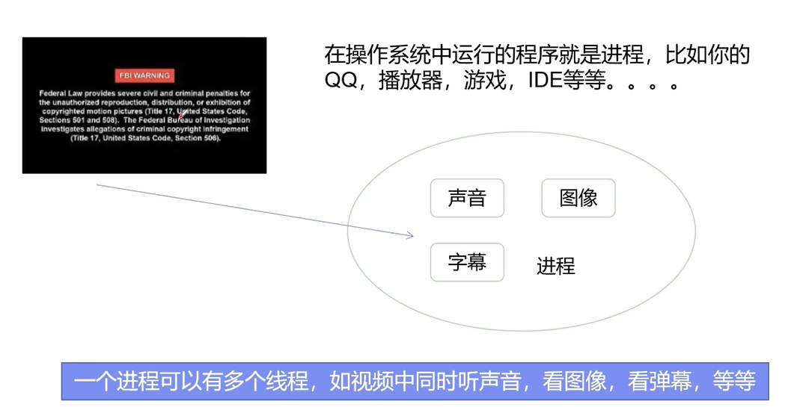

**Process与Thread**

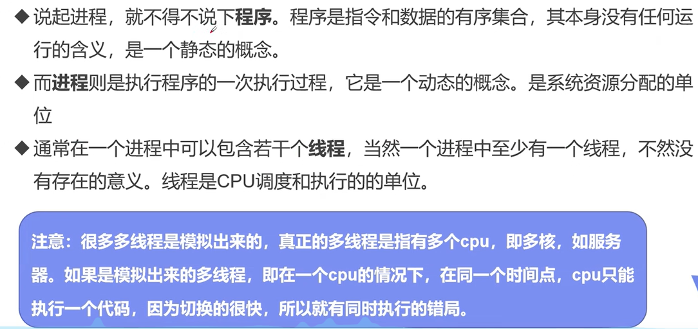

**本节核心概念**

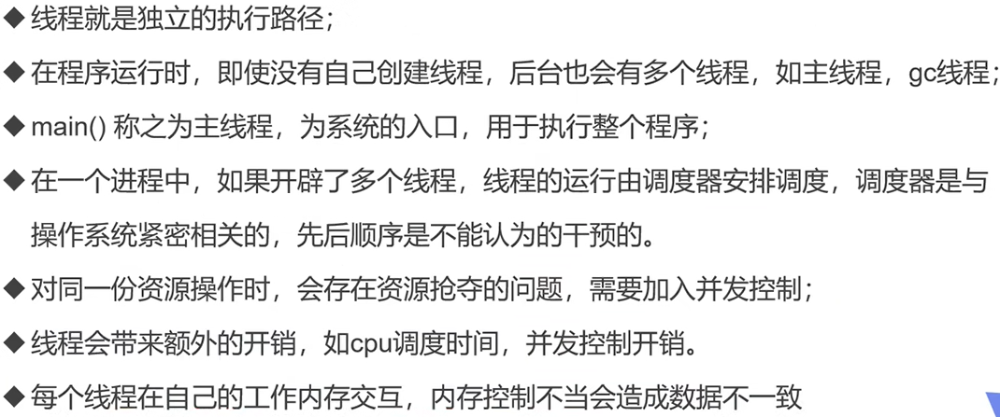

## 02 线程的创建

main线程，gc线程

main线程是用户自己写的

gc线程是Java虚拟机创建的

**三种创建方式**

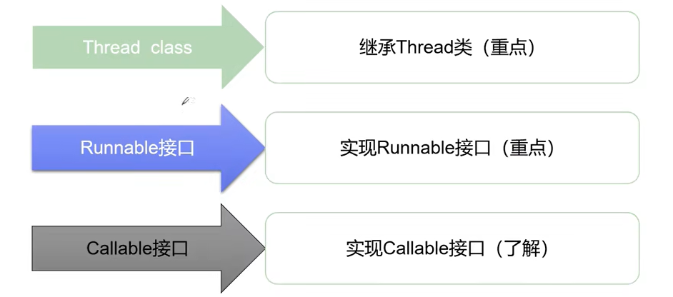

**Thread**

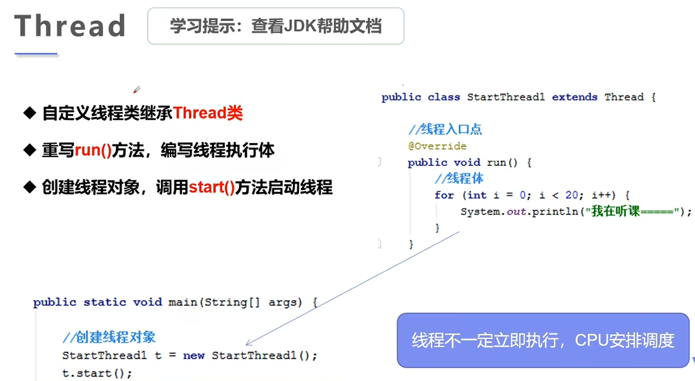

代码：

```java
package demo01;

//创建线程方式一：继承Thread类,重写run方法，调研start开启线程
public class TestThread1 extends Thread{

    @Override
    public void run() {
        //run方法线程体
        for (int i=0;i<20;i++){
            System.out.println("我在看代码---"+i);
        }
    }

    public static void main(String[] args) {
        //main线程，主线程
        
        //创建一个线程对象
        TestThread1 thread1 = new TestThread1();
        //调用start方法,开启线程
        thread1.start();

        for (int i = 0; i < 2000; i++) {
            System.out.println("我在学习多线程---"+i);
        }
    }
}
```

运行结果：

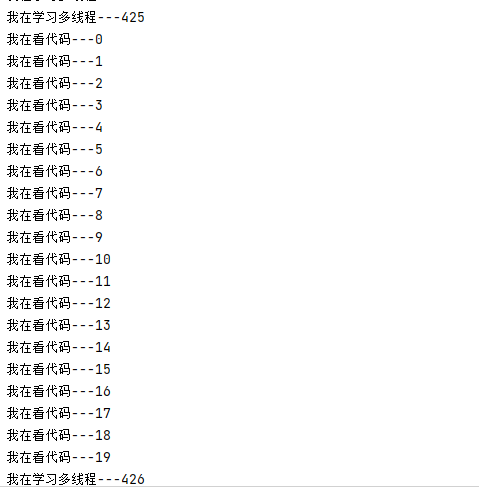

**使用线程下载图片**

代码：

```java
package com.zhk.demo1;

import org.apache.commons.io.FileUtils;

import java.io.File;
import java.io.IOException;
import java.net.URL;

//练习Thread，多线程实现下载图片
public class TestThread2 extends Thread{

    private String url;
    private String name;
    public TestThread2(String url,String name){
        this.url = url;
        this.name = name;
    }

    //下载图片线程的执行体
    @Override
    public void run() {
        //线程体
        WebDownloader webDownloader = new WebDownloader();
        webDownloader.downloader(url,name);
        System.out.println("文件下载成功。"+name);
    }

    public static void main(String[] args) {
        TestThread2 t1 = new TestThread2("https://pic3.zhimg.com/v2-6f474edfce5f6a065baf944f11410c68_r.jpg","E:/imgs/1.jpg");
        TestThread2 t2 = new TestThread2("https://pic2.zhimg.com/v2-6d9fcfa07d4dfbbc75f586c2fbfb0811_r.jpg","E:/imgs/2.jpg");
        TestThread2 t3 = new TestThread2("https://pic3.zhimg.com/v2-01d5a2c2a3fcf99a35fa1c76ac7ed612_r.jpg","E:/imgs/3.jpg");

        t1.start();
        t2.start();
        t3.start();

    }
}

//下载器
class WebDownloader{
    //下载方法
    public void downloader(String url,String name){
        try {
            FileUtils.copyURLToFile(new URL(url),new File(name));
        } catch (IOException e) {
            e.printStackTrace();
            System.out.println("IO异常，downloader方法出问题了");
        }
    }

}
```

结果：

可以发现顺序不一样，说明线程是同时执行的。

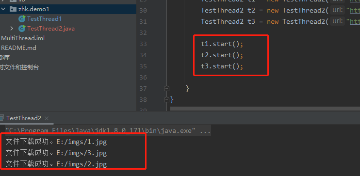

**Runable**

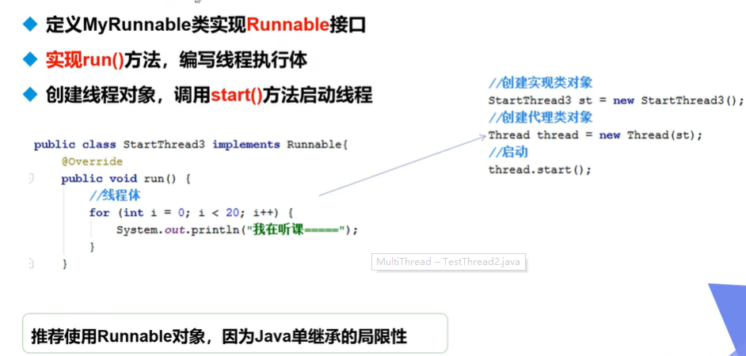

代码：

```java
package com.zhk.demo1;

//线程实现方法2：实现Runnable接口，实现run方法，执行线程需要丢入runnable实现类，调用strat方法
public class TestThread3 implements Runnable{
    @Override
    public void run() {
        //run方法线程体
        for (int i=0;i<20;i++){
            System.out.println("我在看代码---"+i);
        }
    }

    public static void main(String[] args) {
        //main线程，主线程

        //创建一个Runnable接口实现类对象
        TestThread3 testThread3 = new TestThread3();
        //创建线程对象，通过线程对象来开启我们的线程，代理
//        Thread thread = new Thread(testThread3);
//        //调用start方法,开启线程
//        thread.start();

        new Thread(testThread3).start();


        for (int i = 0; i < 2000; i++) {
            System.out.println("我在学习多线程---"+i);
        }
    }

}
```

运行结果：

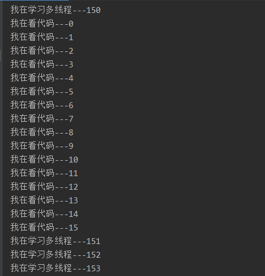

**小节**

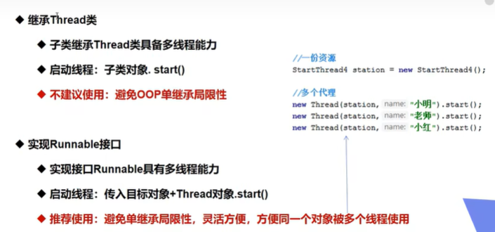

**多个线程同时操作一个对象--买火车票的例子**

```java
public class TestThread4 implements Runnable{

    private int trickNums = 10;

    @Override
    public void run() {
        while (true){
            if (trickNums<=0){
                break;
            }

            //模拟延时
            try {
                Thread.sleep(200);
            } catch (InterruptedException e) {
                throw new RuntimeException(e);
            }
            System.out.println(Thread.currentThread().getName()+"--->拿到了第"+trickNums--+"张票");
        }
    }

    public static void main(String[] args) {

        //一份资源
        TestThread4 trick = new TestThread4();

        new Thread(trick,"小明").start();
        new Thread(trick,"小王").start();
        new Thread(trick,"小张").start();
    }
}
```

结果：

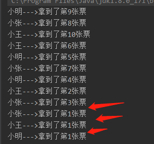

`发现问题：多个线程操作同一个资源的情况下，线程不安全，数据紊乱。`

**案例--龟兔赛跑**

1. 首先来个赛道距离，然后要离终点越来越近
2. 判断比赛是否结束
3. 打印出胜利者
4. 亀兔赛跑开始
5. 故事中是乌龟赢的，兔子需要睡觉，所以我们来模拟兔子睡觉
6. 终于，乌龟赢得比赛

```java
package com.zhk.demo1;

//模拟龟兔赛跑
public class Race implements Runnable{

    //胜利者
    private static String winner;

    @Override
    public void run() {
        for (int i = 1; i <= 100; i++) {
            if (Thread.currentThread().getName().equals("兔子") && i%10==0){
                try {
                    Thread.sleep(5);
                } catch (InterruptedException e) {
                    throw new RuntimeException(e);
                }
            }

            //判断比赛是否结束
            boolean flag = gameOver(i);
            if (flag){
                break;
            }
            System.out.println(Thread.currentThread().getName()+"-->跑了"+i+"步");
        }
    }

    //判断是否完成比赛
    private boolean gameOver(int steps){
        if (winner!=null){
            return true;
        }{
            if (steps>=100){
                winner = Thread.currentThread().getName();
                System.out.println("winner is "+winner);
                return true;
            }
        }
        return false;
    }

    public static void main(String[] args) {
        Race race = new Race();

        new Thread(race,"兔子").start();
        new Thread(race,"乌龟").start();
    }
}
```

## 03多线程--静态代理


案例：

```java
package com.zhk.demo2;

//静态代理模式总结
//真实对象和代理对象都有实现同一个接口
//代理对象要代理真实角色

//好处：代理对象可以做很多真实对象做不了的事情，真实对象专注自己的事情


public class StaticProxy {

    public static void main(String[] args) {

        You you = new You();//你要结婚
//        WeddingCompany weddingCompany = new WeddingCompany(you);
//        weddingCompany.HappyMarry();

        //对比下面2句话，体会线程的静态代理
        new Thread(()-> System.out.println("我爱你")).start();
        new WeddingCompany(new You()).HappyMarry();
    }
}

interface Marry{
    void HappyMarry();
}

//真实角色
class You implements Marry{

    @Override
    public void HappyMarry() {
        System.out.println("狗子要结婚了，超开心");
    }
}

//代理角色

class WeddingCompany implements Marry{
    //代理谁-->真实目标角色
    private Marry target;
    public WeddingCompany(Marry target){
        this.target = target;
    }

    @Override
    public void HappyMarry() {
        before();
        this.target.HappyMarry();//这就是真实角色
        after();
    }

    private void after() {
        System.out.println("结婚之后收尾款");
    }

    private void before() {
        System.out.println("结婚之前布置现场");
    }
}
```

## 04线程状态（五大状态）

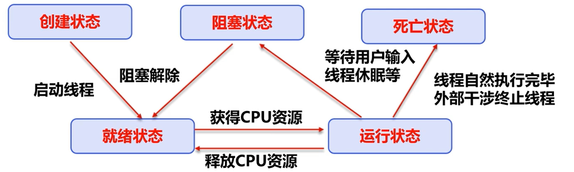

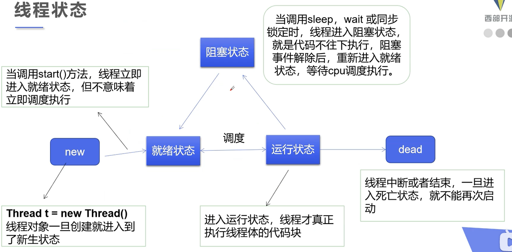

**线程方法**


**停止线程**

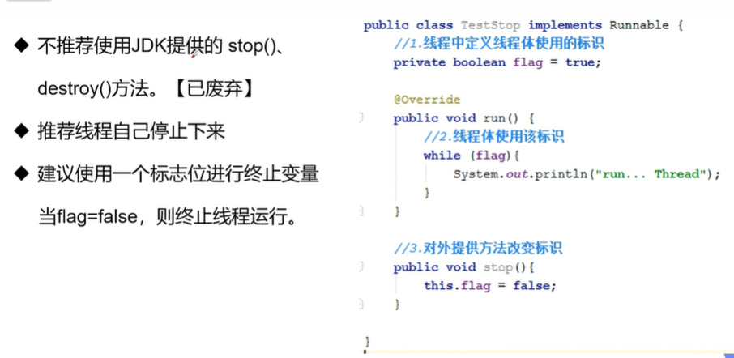

```java
package com.zhk.state;

//测试停止线程
//1.建议线程正常停止-->利用次数，不建议死循环
//2.建议使用标注位
//3.不要使用stop或destory过时或JDK不建议的方法
public class TestStop implements Runnable{

    //设置一个标志位
    private boolean flag = true;

    @Override
    public void run() {
        int i =0;
        while (flag){
            System.out.println("running...Thread"+i++);
        }
    }

    //2.设置一个公开的方法停止线程,转换标志位
    public void stop(){
        this.flag = false;
    }

    public static void main(String[] args) {
        TestStop testStop = new TestStop();
        new Thread(testStop).start();

        for (int i = 0; i < 1000; i++) {
            System.out.println("main"+i);
            if (i==900){
                //调用stop方法停止线程
                testStop.stop();
                System.out.println("线程停止了");
            }
        }
    }
}
```

**线程休眠**

sleep (时间) 指定当前线程阻塞的毫秒数；
sleep存在异常InterruptedException;

sleep时间达到后线程进入就绪状态；
sleep可以模拟网络延时，倒计时等。
每一个对象都有一个锁， sleep不会释放锁；

**线程礼让**

代码：

```java
package com.zhk.state;

/**
 * 测试礼让线程
 * 礼让不一定成功，看CPU心情
 */
public class TestYield {
    public static void main(String[] args) {
        MyYield myYield = new MyYield();

        new Thread(myYield,"A线程").start();
        new Thread(myYield,"B线程").start();
    }
}

class MyYield implements Runnable{

    @Override
    public void run() {
        System.out.println(Thread.currentThread().getName()+"线程开始执行");
        Thread.yield();
        System.out.println(Thread.currentThread().getName()+"线程结束执行");
    }
}
```

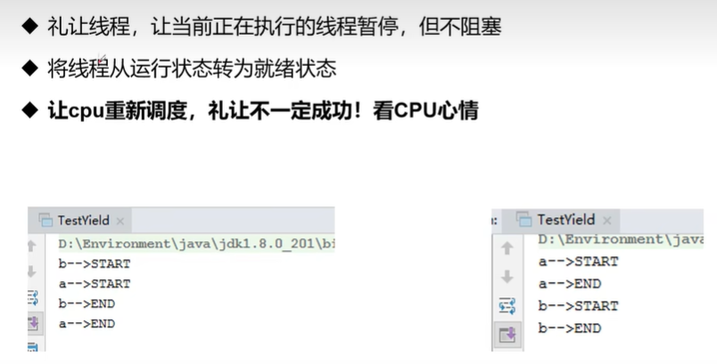

**线程插队**

代码：

```java
package com.zhk.state;

/**
 * 测试jion方法、、想象为插队
 */
public class TestJoin implements Runnable{
    @Override
    public void run() {
        for (int i = 0; i < 100; i++) {
            System.out.println("线程VIP来了");
        }
    }

    public static void main(String[] args) throws InterruptedException {
        TestJoin testJoin = new TestJoin();
        Thread thread = new Thread(testJoin);
        thread.start();

        //主线程
        for (int i = 0; i < 1000; i++) {
            if (i==200){
                thread.join();//插队
            }
            System.out.println("main"+i);
        }
    }
}
```

结果：


**守护线程**


## 05线程同步

多个线程操作同一个资源

**并发**：(联想之前的抢火车票的例子)


