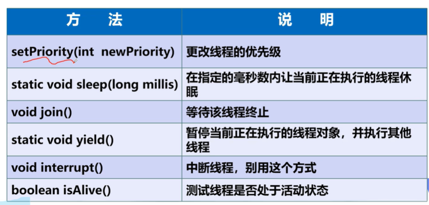
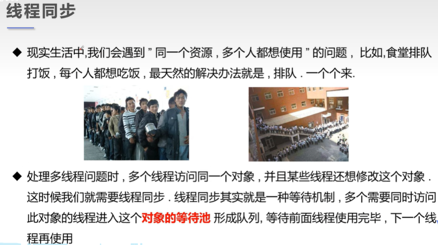

# Multithreading

> 课程链接：https://www.bilibili.com/video/BV1V4411p7EF?p=1&vd_source=b67ce643ed65f6136a48fb03481df142

- [Multithreading](#multithreading)
  - [01线程简介](#01线程简介)
  - [02 线程的创建](#02-线程的创建)
  - [03多线程--静态代理](#03多线程--静态代理)
  - [04线程状态（五大状态）](#04线程状态五大状态)
  - [05线程同步](#05线程同步)
  - [06死锁](#06死锁)
  - [07 Lock锁](#07-lock锁)
  - [08线程协作](#08线程协作)
  - [09线程池](#09线程池)
  - [10总结](#10总结)
##  01线程简介

任务，进程，线程，多线程


**多任务**：


**多线程：**


**普通方法调用和多线程：**


**程序、进程、线程**


**Process与Thread**


**本节核心概念**


##  02 线程的创建

main线程，gc线程

main线程是用户自己写的

gc线程是Java虚拟机创建的

**三种创建方式**


**Thread**


代码：

```java
package demo01;

//创建线程方式一：继承Thread类,重写run方法，调研start开启线程
public class TestThread1 extends Thread{

    @Override
    public void run() {
        //run方法线程体
        for (int i=0;i<20;i++){
            System.out.println("我在看代码---"+i);
        }
    }

    public static void main(String[] args) {
        //main线程，主线程
        
        //创建一个线程对象
        TestThread1 thread1 = new TestThread1();
        //调用start方法,开启线程
        thread1.start();

        for (int i = 0; i < 2000; i++) {
            System.out.println("我在学习多线程---"+i);
        }
    }
}
```

运行结果：


**使用线程下载图片**

代码：

```java
package com.zhk.demo1;

import org.apache.commons.io.FileUtils;

import java.io.File;
import java.io.IOException;
import java.net.URL;

//练习Thread，多线程实现下载图片
public class TestThread2 extends Thread{

    private String url;
    private String name;
    public TestThread2(String url,String name){
        this.url = url;
        this.name = name;
    }

    //下载图片线程的执行体
    @Override
    public void run() {
        //线程体
        WebDownloader webDownloader = new WebDownloader();
        webDownloader.downloader(url,name);
        System.out.println("文件下载成功。"+name);
    }

    public static void main(String[] args) {
        TestThread2 t1 = new TestThread2("https://pic3.zhimg.com/v2-6f474edfce5f6a065baf944f11410c68_r.jpg","E:/imgs/1.jpg");
        TestThread2 t2 = new TestThread2("https://pic2.zhimg.com/v2-6d9fcfa07d4dfbbc75f586c2fbfb0811_r.jpg","E:/imgs/2.jpg");
        TestThread2 t3 = new TestThread2("https://pic3.zhimg.com/v2-01d5a2c2a3fcf99a35fa1c76ac7ed612_r.jpg","E:/imgs/3.jpg");

        t1.start();
        t2.start();
        t3.start();

    }
}

//下载器
class WebDownloader{
    //下载方法
    public void downloader(String url,String name){
        try {
            FileUtils.copyURLToFile(new URL(url),new File(name));
        } catch (IOException e) {
            e.printStackTrace();
            System.out.println("IO异常，downloader方法出问题了");
        }
    }

}
```

结果：

可以发现顺序不一样，说明线程是同时执行的。


**Runable**


代码：

```java
package com.zhk.demo1;

//线程实现方法2：实现Runnable接口，实现run方法，执行线程需要丢入runnable实现类，调用strat方法
public class TestThread3 implements Runnable{
    @Override
    public void run() {
        //run方法线程体
        for (int i=0;i<20;i++){
            System.out.println("我在看代码---"+i);
        }
    }

    public static void main(String[] args) {
        //main线程，主线程

        //创建一个Runnable接口实现类对象
        TestThread3 testThread3 = new TestThread3();
        //创建线程对象，通过线程对象来开启我们的线程，代理
//        Thread thread = new Thread(testThread3);
//        //调用start方法,开启线程
//        thread.start();

        new Thread(testThread3).start();


        for (int i = 0; i < 2000; i++) {
            System.out.println("我在学习多线程---"+i);
        }
    }

}
```

运行结果：


**小节**


**多个线程同时操作一个对象--买火车票的例子**

```java
public class TestThread4 implements Runnable{

    private int trickNums = 10;

    @Override
    public void run() {
        while (true){
            if (trickNums<=0){
                break;
            }

            //模拟延时
            try {
                Thread.sleep(200);
            } catch (InterruptedException e) {
                throw new RuntimeException(e);
            }
            System.out.println(Thread.currentThread().getName()+"--->拿到了第"+trickNums--+"张票");
        }
    }

    public static void main(String[] args) {

        //一份资源
        TestThread4 trick = new TestThread4();

        new Thread(trick,"小明").start();
        new Thread(trick,"小王").start();
        new Thread(trick,"小张").start();
    }
}
```

结果：


`发现问题：多个线程操作同一个资源的情况下，线程不安全，数据紊乱。`

**案例--龟兔赛跑**

1. 首先来个赛道距离，然后要离终点越来越近
2. 判断比赛是否结束
3. 打印出胜利者
4. 亀兔赛跑开始
5. 故事中是乌龟赢的，兔子需要睡觉，所以我们来模拟兔子睡觉
6. 终于，乌龟赢得比赛

```java
package com.zhk.demo1;

//模拟龟兔赛跑
public class Race implements Runnable{

    //胜利者
    private static String winner;

    @Override
    public void run() {
        for (int i = 1; i <= 100; i++) {
            if (Thread.currentThread().getName().equals("兔子") && i%10==0){
                try {
                    Thread.sleep(5);
                } catch (InterruptedException e) {
                    throw new RuntimeException(e);
                }
            }

            //判断比赛是否结束
            boolean flag = gameOver(i);
            if (flag){
                break;
            }
            System.out.println(Thread.currentThread().getName()+"-->跑了"+i+"步");
        }
    }

    //判断是否完成比赛
    private boolean gameOver(int steps){
        if (winner!=null){
            return true;
        }{
            if (steps>=100){
                winner = Thread.currentThread().getName();
                System.out.println("winner is "+winner);
                return true;
            }
        }
        return false;
    }

    public static void main(String[] args) {
        Race race = new Race();

        new Thread(race,"兔子").start();
        new Thread(race,"乌龟").start();
    }
}
```

##  03多线程--静态代理


案例：

```java
package com.zhk.demo2;

//静态代理模式总结
//真实对象和代理对象都有实现同一个接口
//代理对象要代理真实角色

//好处：代理对象可以做很多真实对象做不了的事情，真实对象专注自己的事情


public class StaticProxy {

    public static void main(String[] args) {

        You you = new You();//你要结婚
//        WeddingCompany weddingCompany = new WeddingCompany(you);
//        weddingCompany.HappyMarry();

        //对比下面2句话，体会线程的静态代理
        new Thread(()-> System.out.println("我爱你")).start();
        new WeddingCompany(new You()).HappyMarry();
    }
}

interface Marry{
    void HappyMarry();
}

//真实角色
class You implements Marry{

    @Override
    public void HappyMarry() {
        System.out.println("狗子要结婚了，超开心");
    }
}

//代理角色

class WeddingCompany implements Marry{
    //代理谁-->真实目标角色
    private Marry target;
    public WeddingCompany(Marry target){
        this.target = target;
    }

    @Override
    public void HappyMarry() {
        before();
        this.target.HappyMarry();//这就是真实角色
        after();
    }

    private void after() {
        System.out.println("结婚之后收尾款");
    }

    private void before() {
        System.out.println("结婚之前布置现场");
    }
}
```

##  04线程状态（五大状态）


**线程方法**



**停止线程**


```java
package com.zhk.state;

//测试停止线程
//1.建议线程正常停止-->利用次数，不建议死循环
//2.建议使用标注位
//3.不要使用stop或destory过时或JDK不建议的方法
public class TestStop implements Runnable{

    //设置一个标志位
    private boolean flag = true;

    @Override
    public void run() {
        int i =0;
        while (flag){
            System.out.println("running...Thread"+i++);
        }
    }

    //2.设置一个公开的方法停止线程,转换标志位
    public void stop(){
        this.flag = false;
    }

    public static void main(String[] args) {
        TestStop testStop = new TestStop();
        new Thread(testStop).start();

        for (int i = 0; i < 1000; i++) {
            System.out.println("main"+i);
            if (i==900){
                //调用stop方法停止线程
                testStop.stop();
                System.out.println("线程停止了");
            }
        }
    }
}
```

**线程休眠**

sleep (时间) 指定当前线程阻塞的毫秒数；
sleep存在异常InterruptedException;

sleep时间达到后线程进入就绪状态；
sleep可以模拟网络延时，倒计时等。
每一个对象都有一个锁， sleep不会释放锁；

**线程礼让**

代码：

```java
package com.zhk.state;

/**
 * 测试礼让线程
 * 礼让不一定成功，看CPU心情
 */
public class TestYield {
    public static void main(String[] args) {
        MyYield myYield = new MyYield();

        new Thread(myYield,"A线程").start();
        new Thread(myYield,"B线程").start();
    }
}

class MyYield implements Runnable{

    @Override
    public void run() {
        System.out.println(Thread.currentThread().getName()+"线程开始执行");
        Thread.yield();
        System.out.println(Thread.currentThread().getName()+"线程结束执行");
    }
}
```


**线程插队**

代码：

```java
package com.zhk.state;

/**
 * 测试jion方法、、想象为插队
 */
public class TestJoin implements Runnable{
    @Override
    public void run() {
        for (int i = 0; i < 100; i++) {
            System.out.println("线程VIP来了");
        }
    }

    public static void main(String[] args) throws InterruptedException {
        TestJoin testJoin = new TestJoin();
        Thread thread = new Thread(testJoin);
        thread.start();

        //主线程
        for (int i = 0; i < 1000; i++) {
            if (i==200){
                thread.join();//插队
            }
            System.out.println("main"+i);
        }
    }
}
```

结果：


**守护线程**


##  05线程同步

多个线程操作同一个资源

**并发**：(联想之前的抢火车票的例子)




- 队列和锁保证**线程同步的安全性**
- 线程同步


**同步方法**


同步方法会影响效率：


因此引出了同步块


在银行取钱的例子中，我们发现如果在run方法前加synchronized，发现仍然发生了多个对象抢占一个资源的问题。

```java
public synchronized void run() {
    //判断有没有钱
    if (account.money-drawingMoney<0){
        System.out.println(Thread.currentThread().getName()+"钱不够");
        return;
    }
    try {
        Thread.sleep(1000);
    } catch (InterruptedException e) {
        throw new RuntimeException(e);
    }
    account.money = account.money - drawingMoney;
    nowMoney = nowMoney + drawingMoney;

    System.out.println(account.name+"余额为："+account.money);
    System.out.println(this.getName()+"手里的钱："+nowMoney);
}
```

输出结果：

```
结婚基金余额为：-50
结婚基金余额为：-50
girlFriend手里的钱：100
你手里的钱：50
```

原因是：`synchronized方法 默认锁的是this 可以发现这个加了synchronized锁不了，因为我们实际操作的对象是银行账户啊！所以需要synchronized块（同步块）.`

因此需要需要synchronized块，修改的代码为：

synchronized块（同步块）可以锁任何对象。

```java
public synchronized void run() {
	//锁的对象就是变化的量，增删改
    synchronized (account) {
        //判断有没有钱
        if (account.money-drawingMoney<0){
            System.out.println(Thread.currentThread().getName()+"钱不够");
            return;
        }
        try {
            Thread.sleep(1000);
        } catch (InterruptedException e) {
            throw new RuntimeException(e);
        }
        account.money = account.money - drawingMoney;
        nowMoney = nowMoney + drawingMoney;

        System.out.println(account.name+"余额为："+account.money);
        System.out.println(this.getName()+"手里的钱："+nowMoney);
    }

}
```

此时输出结果正常：

```
结婚基金余额为：50
你手里的钱：50
girlFriend钱不够
```

同时concurrent包下面的CopyOnWriteArrayList是线程安全的，不用加synchronized块即可保证安全性。

```java
public static void main(String[] args) {
        //CopyOnWriteArrayList线程安全的
        CopyOnWriteArrayList<String> list = new CopyOnWriteArrayList<>();
        for (int i = 0; i < 10000; i++) {
            new Thread(()->{
                list.add(Thread.currentThread().getName());
            }).start();
        }
        try {
            Thread.sleep(3000);
        } catch (InterruptedException e) {
            throw new RuntimeException(e);
        }
        System.out.println(list.size());
    }
```

##  06死锁

多个线程各自占有一些共享资源,，并且互相等待其他线程占有的资源才能运行， 而导致两个或者多个线程都在等待对方释放资源, 都停止执行的情形 。**某一个同步块同时拥有 “两个以上对象的锁 " 时，就可能会发生 “死锁” 的问题。**

代码案例（两个女生化妆，抢占口红和镜子资源，一个女生先占口红等待镜子，另外一个先占镜子等待口红）：

```java
package com.zhk.lock;

/**
 * 死锁的demo
 * 死锁：多个线程互相抱着对方需要的资源，然后形成僵持。
 */
public class DeadLock {
    public static void main(String[] args) {
        Makeup g1 = new Makeup(0,"灰姑娘");
        Makeup g2 = new Makeup(1,"白雪公主");

        g1.start();
        g2.start();
    }
}
//口红
class Lipstick {

}
//镜子
class Mirror {

}

class Makeup extends Thread{

    //需要的资源只有一份，用static来保证
    //如果一个数据需要被所有对象共享使用的时候，这时候即可好实用static修饰
    static Lipstick lipstick = new Lipstick();
    static Mirror mirror = new Mirror();

    int choice;//化妆的人的选择（对资源的使用顺序）
    String girlName;//使用化妆品的人

    Makeup(int choice,String girlName){
        this.choice = choice;
        this.girlName = girlName;
    }

    @Override
    public void run() {
        //化妆
        try {
            makeup();
        } catch (InterruptedException e) {
            throw new RuntimeException(e);
        }
    }

    //化妆 ，互相持有对方的锁，就是需要拿到对方的资源
    private void makeup() throws InterruptedException {
        if (choice==0) {//第一个人的情况
            synchronized (lipstick){//获得口红的锁
                System.out.println(this.girlName+"获得口红的锁");
                Thread.sleep(1000);
                synchronized (mirror){//1s后想获得镜子资源
                    System.out.println(this.girlName+"获得镜子的锁");
                }
            }
        } else {
            synchronized (mirror){//获得镜子的锁,想获得镜子资源
                System.out.println(this.girlName+"获得镜子的锁");
                Thread.sleep(2000);
                synchronized (lipstick){//1s后想获得获得口红的锁
                    System.out.println(this.girlName+"获得口红的锁");
                }
            }
        }
    }
}
```

效果：


可以发现两个对象共同抢占他们的第一个资源后，都在等待彼此的第二个资源。程序一直卡着，发生了死锁。

**解决方法：**（不让其抱对方的锁，把锁拿出来）

```java
//化妆 ，互相持有对方的锁，就是需要拿到对方的资源
    private void makeup() throws InterruptedException {
        if (choice==0) {//第一个人的情况
            synchronized (lipstick){//获得口红的锁
                System.out.println(this.girlName+"获得口红的锁");
                Thread.sleep(1000);
            }//释放锁
            synchronized (mirror){//1s后想获得镜子资源
                System.out.println(this.girlName+"获得镜子的锁");
            }
        } else {
            synchronized (mirror){//获得镜子的锁,想获得镜子资源
                System.out.println(this.girlName+"获得镜子的锁");
                Thread.sleep(2000);
            }//释放锁
            synchronized (lipstick){//1s后想获得获得口红的锁
                System.out.println(this.girlName+"获得口红的锁");
            }
        }
    }
```


**总结**

产生死锁的四个必要条件:
1. 互斥条件: 一个资源每次只能被一个进程使用。
2. 请求与保持条件: 一个进程因清求资源而阻塞时, 对已获得的资源保持不放。
3. 不剥夺条件 : 进程已获得的资源，在末使用完之前，不能蟲行剥夺。
4. 循环等待条件: 若干进程之间形成一种头尾相接的循环等待资源关系。

上面列出了死锁的四个必要条件，我们只要想办法破其中的任意一个或多个条件 就可以避免死锁发生。

##  07 Lock锁

- 从JDK 5.0开始，Java提供了面强大的线程同步机制-----通过显式定义同步锁对象来实现同步。同步锁使用Lock对象充当。
- java.util.concurrent.locks.Lock接口是控制多个线程对共享资源进行访问的工具。 锁提供了对共享资源的独占访问，每次只能有一个线程对Lock对象加锁，线程开始访问共享资源之前应先获得Lock对象。
- ReentrantLock （可重入锁）类实现了Lock，它拥有与 synchronized 相同的并发性和内存语义，在实现线程安全的控制中，比较常用的是ReentrantLock，可以显式加锁、释放锁。

例子：

三人买票不加lock锁的代码：

```java
package com.zhk.lock;

//测试Lock锁
public class TestLock {
    public static void main(String[] args) {
        TestLock2 lock2 = new TestLock2();

        new Thread(lock2).start();
        new Thread(lock2).start();
        new Thread(lock2).start();
    }
}
//买票的例子
class TestLock2 implements Runnable{
    int trickNums = 10;

    @Override
    public void run() {
        while (true){
            if (trickNums>0){
                try {
                    Thread.sleep(1000);
                } catch (InterruptedException e) {
                    throw new RuntimeException(e);
                }
                System.out.println(trickNums--);
            }else {
                break;
            }
        }
    }
}

```


加Lock锁代码：

```java
@Override
    public void run() {
        while (true){
            try {
                lock.lock();//加锁
                if (trickNums>0){
                    try {
                        Thread.sleep(1000);
                    } catch (InterruptedException e) {
                        throw new RuntimeException(e);
                    }
                    System.out.println(trickNums--);
                }else {
                    break;
                }
            } finally {
                lock.unlock();//解锁
            }

        }
    }
```


**synchronized和Lock的对比**

- Lock是显式锁（手动开启和关闭锁，别忘记关闭锁) synchronized是隐式锁，出了作用域自动释放。
- Lock只有代码块锁， synchronized有代码块锁和方法锁
- 使用Lock锁，JVM将花费较少的时间来调度线程，性能更好。并且具有更好的扩展性（提供更多的子类)
- 优先使用顺序: 
  - Lock > 同步代码块 (已经进入了方法体，分配了相应资源) > 同步方法 (在方法体之外)

##  08线程协作

> 生产者消费者问题

应用场景 : 生产者和消费者问题

- 假设仓库中只能存放一件产品, 生产者将生产出来的产品放入仓库, 消费者将 仓库中产品取走消费 。
- 如果仓库中没有产品, 则生产者将产品放入仓库, 否则停止生产并等待, 直到 仓库中的产品被消费者取走为止 。
- 如果仓库中放有产品, 则消费者可以将产品取走消费, 否则停止消费并等待, 直到仓库中再次放入产品为止 。

分析：

这是一个线程同步问题, 生产者和消费者共享同一个资源, 并且生产者和消费者之 间相互依赖，互为条件。
- 对于生产者, 没有生产产品之前, 要通知消费者等待 . 而生产了产品之后, 又 需要马上通知消费者消费。
- 对于消费者, 在消费之后, 要通知生产者已经结束消费, 需要生产新的产品 以供消费。
- 在生产者消费者问题中, 仅有synchronized是不够的
  - synchronized 可阻止并发更新同一个共享资源, 实现了同步。
  - synchronized 不能用来实现不同线程之间的消息传递 (通信)。


**解决方式1**

通过缓冲区


代码案例：

```java
package com.zhk.commniciation;

//测试 生产者消费者问题--> 利用缓冲区解决（管程法）

//生产者、消费者、产品、缓冲区

public class TestPC {
    public static void main(String[] args) {
        Container container = new Container();

        new Productor(container).start();
        new Consumer(container).start();
    }
}

//生产者
class Productor extends Thread{
    Container container;
    public Productor(Container container){
        this.container = container;
    }

    //生产产品
    @Override
    public void run() {
        for (int i = 0; i < 100; i++) {
            System.out.println("生产了-->"+i+"只鸡");
            container.push(new Chicken(i));
        }
    }
}
//消费者
class Consumer extends Thread{
    Container container;
    public Consumer(Container container){
        this.container = container;
    }

    //消费产品
    @Override
    public void run() {
        for (int i = 0; i < 100; i++) {
            System.out.println("消费了-->"+container.pop().id+"只鸡");
        }
    }
}
class Chicken{
    int id;//产品编号

    public Chicken(int id) {
        this.id = id;
    }
}

class Container{
    //需要一个容器大小
    Chicken[] chickens = new Chicken[10];
    //容器计数器
    int counter = 0;

    //生产者生产产品
    public synchronized void push(Chicken chicken){
        //如果容器满了，就需要等待消费者消费
        if (counter==chickens.length){
            //生产等待
            try {
                this.wait();
            } catch (InterruptedException e) {
                throw new RuntimeException(e);
            }
        }
        //如果没有满，我们就需要丢入产品
        chickens[counter] = chicken;
        counter++;

        //可以通知消费者消费了
        this.notifyAll();
    }

    //消费者消费产品
    public synchronized Chicken pop(){
        //判断能否消费
        if (counter==0){
            //等待生产者生产，消费者消费
            try {
                this.wait();
            } catch (InterruptedException e) {
                throw new RuntimeException(e);
            }
        }
        //如果可消费
        counter--;
        Chicken chicken = chickens[counter];

        //吃完了，通知生产者生产
        this.notifyAll();
        return chicken;
    }

}
```

**解决方式2**

信号灯法--通过一个标志位


```java
package com.zhk.commniciation;

//测试生产者消费者问题--> 利用标志位解决（信号灯法）
public class TestPC2 {
    public static void main(String[] args) {
        TV tv = new TV();
        new Player(tv).start();
        new Watcher(tv).start();
    }
}

//生产者--》演员
class Player extends Thread{
    TV tv;
    public Player(TV tv){
        this.tv = tv;
    }

    @Override
    public void run() {
        for (int i = 0; i < 20; i++) {
            if (i%2==0){
                this.tv.play("快乐大本营播放中");
            } else {
                this.tv.play("抖音：记录美好生活");
            }
        }
    }
}
//消费者==》观众
class Watcher extends Thread{
    TV tv;
    public Watcher(TV tv){
        this.tv = tv;
    }

    @Override
    public void run() {
        for (int i = 0; i < 20; i++) {
            this.tv.watch();
        }
    }
}
//产品（资源）==》节目
class TV{
    //演员表演，观众等待 true
    //观众观看，演员等待 false
    String voice;//表演的节目
    boolean flag = true;//什么时候演员表演，什么时候观众观看

    //表演
    public synchronized void play(String voice){
        if (!flag){//演员等待
            try {
                this.wait();
            } catch (InterruptedException e) {
                throw new RuntimeException(e);
            }
        }
        System.out.println("演员表演了："+voice);
        //通知观众观看
        this.notifyAll();
        this.voice = voice;
        this.flag=!flag;
    }
    //观看
    public synchronized void watch(){
        if (flag){//观众等待
            try {
                this.wait();
            } catch (InterruptedException e) {
                throw new RuntimeException(e);
            }
        }
        System.out.println("观众观看了："+voice);
        //通知演员表演
        this.notifyAll();
        this.flag=!flag;
    }
}
```

结果：演员表演啥，观众看啥，一一对应


## 09线程池


```java
package com.zhk.threadpool;

import java.util.concurrent.ExecutorService;
import java.util.concurrent.Executors;

//测试线程池
public class TestPool {
    public static void main(String[] args) {
        //1.创建一个线程池
        //newFixedThreadPool 参数为：线程池大小
        ExecutorService service = Executors.newFixedThreadPool(10);
        //执行
        service.execute(new MyThread());
        service.execute(new MyThread());
        service.execute(new MyThread());
        service.execute(new MyThread());

        //2.关闭连接
        service.shutdown();
    }
}

class MyThread implements Runnable{
    @Override
    public void run() {
        System.out.println(Thread.currentThread().getName());
    }
}
```


## 10总结

```java
//回顾总结线程的创建
public class Summary {
    public static void main(String[] args) {

        new MyThread1().start();

        new Thread(new MyThread2()).start();

        FutureTask<Integer> futureTask = new FutureTask<>(new MyThread3());
        new Thread(futureTask).start();
        try {
            Integer res = futureTask.get();
            System.out.println(res);
        } catch (InterruptedException e) {
            throw new RuntimeException(e);
        } catch (ExecutionException e) {
            throw new RuntimeException(e);
        }
    }
}
//1.集成Thread类
class MyThread1 extends Thread{
    @Override
    public void run() {
        System.out.println("MyThread1");
    }
}

//2.实现Runnable接口
class MyThread2 implements Runnable{
    @Override
    public void run() {
        System.out.println("MyThread2");
    }
}

//3.实现Callable接口
class MyThread3 implements Callable{

    @Override
    public Integer call() throws Exception {
        System.out.println("MyThread3");
        return 100;
    }
}
```


