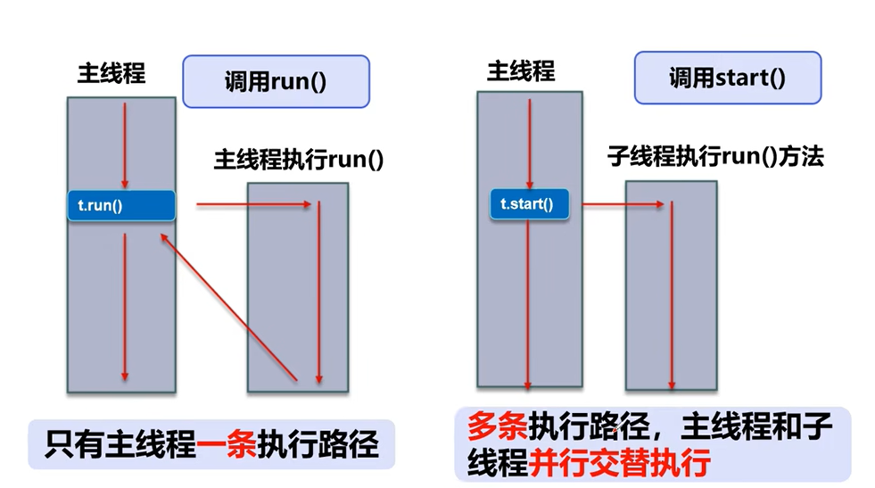

# Multithreading

> 课程链接：https://www.bilibili.com/video/BV1V4411p7EF?p=1&vd_source=b67ce643ed65f6136a48fb03481df142


多线程demo

## 01线程简介

任务，进程，线程，多线程


**多任务**：


**多线程：**


**普通方法调用和多线程：**



**程序、进程、线程**


**Process与Thread**


**本节核心概念**


## 02 线程的创建

main线程，gc线程

main线程是用户自己写的

gc线程是Java虚拟机创建的

**三种创建方式**


**Thread**


代码：

```java
package demo01;

//创建线程方式一：继承Thread类,重写run方法，调研start开启线程
public class TestThread1 extends Thread{

    @Override
    public void run() {
        //run方法线程体
        for (int i=0;i<20;i++){
            System.out.println("我在看代码---"+i);
        }
    }

    public static void main(String[] args) {
        //main线程，主线程
        
        //创建一个线程对象
        TestThread1 thread1 = new TestThread1();
        //调用start方法,开启线程
        thread1.start();

        for (int i = 0; i < 2000; i++) {
            System.out.println("我在学习多线程---"+i);
        }
    }
}
```

运行结果：


